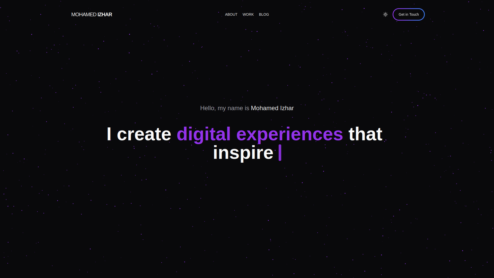

<div align="center">
    <h1>Izhar's Portfolio</h1>
</div>
Welcome to the frontend of my portfolio website! This project showcases my skills and experience as a web developer. It is built with Next.js, Framer Motion, and Tailwind CSS, and integrates with a backend built on Django DRF for content management.

## Features

-   **Responsive Design**: The website is fully responsive and works on all devices. Optimized for desktop, tablet, and mobile views.
-   **Dark Mode**: Toggle between light and dark mode.
-   **Framer Motion Animations**: Smooth transitions and interactive animations for engaging user experience.
-   **Dynamic Content**: Integrated with Django DRF for dynamic management of projects, testimonials, and blog content.
-   **SEO Optimized**: Using Next.js for static site generation and server-side rendering for SEO optimization.
-   **Contact Form**: Contact form with email integration for easy communication.

## Tech Stack

-   **Next.js**: React framework for building server-side rendered and static websites.
-   **Framer Motion**: Animation library for React.
-   **Tailwind CSS**: Utility-first CSS framework for rapid UI development.
-   **Django DRF**: Backend API for managing dynamic content which is a [seperate repositery](https://github.com/izharxyz/portfoliofy).
-   **Vercel**: Deployment platform for Next.js applications.

## Installation

1. Clone the repository:

```bash
git clone https://github.com/izharxyz/portfolio.git
```

2. Navigate to the project directory:

```bash
cd portfolio
```

3. Install dependencies:

```bash
yarn install
# or npm install --legacy-peer-deps
```

4. Run the development server:

```bash
yarn dev
# or npm run dev
```

## API Integration

This project is integrated with a Django DRF backend for managing dynamic content. You can find the backend code in the [portfoliofy repository](https://github.com/izharxyz/portfoliofy) which handles content dynamically (such as projects, testimonials, and blog posts). The backend needs to be running separately.

Ensure the `NEXT_PUBLIC_API_URL` is correctly set in the .env file.

## Contributing

Contributions are welcome! Feel free to open an issue or submit a pull request if you have any improvements to the project.

## License

This project is open source and available under the custom [MIT License](LICENSE).
